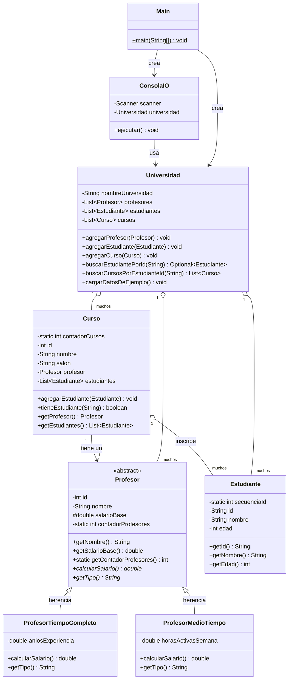

# Diagrama de Diseño (Diagrama de Clases UML)

> GitHub renderiza los diagramas Mermaid automáticamente al ver este archivo
> en github.com. También puedes pegar el bloque de código en
> https://mermaid.live para exportarlo como PNG/SVG.



## Vista de capas

```
com.universidad
 ├── Main.java              (clase principal / punto de entrada)
 ├── modelo/                (capa de datos: Profesor, ProfesorTiempoCompleto, ProfesorMedioTiempo, Estudiante, Curso)
 ├── gestion/                (capa de negocio: Universidad — toda la lógica/búsquedas)
 └── io/                    (capa de presentación: ConsolaIO — toda la lectura/impresión)
```

- **modelo**: datos puros + reglas de negocio (ej. cálculo de salario). Sin `Scanner`
  ni `System.out` aquí.
- **gestion**: orquesta el modelo (agregar/buscar/listar). Tampoco tiene IO de consola.
- **io**: la única capa que puede leer y escribir en consola.
- **Main**: conecta todo y arranca el programa.
